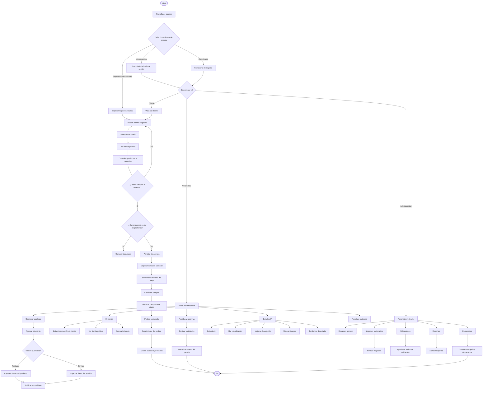

# Diagrama de flujo de Ctrl + She

Este archivo es editable. Puedes cambiar textos, flechas o bloques directamente en el diagrama Mermaid.

```mermaid
flowchart TD
    A([Inicio]) --> B[Pantalla de acceso]
    B --> C{Seleccionar forma de entrada}

    C -->|Explorar como visitante| D[Explorar negocios locales]
    C -->|Iniciar sesión| E[Formulario de inicio de sesión]
    C -->|Registrarse| F[Formulario de registro]

    E --> G{Seleccionar rol}
    F --> G

    G -->|Cliente| H[Vista de cliente]
    G -->|Vendedora| I[Panel de vendedora]
    G -->|Administrador| J[Panel administrador]

    D --> K[Buscar o filtrar negocios]
    H --> K
    K --> L[Seleccionar tienda]
    L --> M[Ver tienda pública]
    M --> N[Consultar productos y servicios]
    N --> O{¿Desea comprar o reservar?}

    O -->|No| K
    O -->|Sí| P{¿Es vendedora en su propia tienda?}
    P -->|Sí| Q[Compra bloqueada]
    P -->|No| R[Pantalla de compra]

    R --> S[Capturar datos de solicitud]
    S --> T[Seleccionar método de pago]
    T --> U[Confirmar compra]
    U --> V[Generar comprobante digital]
    V --> W[Pedido registrado]
    W --> X[Seguimiento del pedido]
    X --> Y[Cliente puede dejar reseña]

    I --> Z[Mi tienda]
    Z --> ZA[Editar información de tienda]
    Z --> ZB[Ver tienda pública]
    Z --> ZC[Compartir tienda]

    I --> AA[Gestionar catálogo]
    AA --> AB[Agregar elemento]
    AB --> AC{Tipo de publicación}
    AC -->|Producto| AD[Capturar datos del producto]
    AC -->|Servicio| AE[Capturar datos del servicio]
    AD --> AF[Publicar en catálogo]
    AE --> AF

    I --> AG[Pedidos y reservas]
    AG --> AH[Revisar solicitudes]
    AH --> AI[Actualizar estado del pedido]

    I --> AJ[Reseñas recibidas]
    I --> AK[Señales IA]
    AK --> AL[Bajo stock]
    AK --> AM[Alta visualización]
    AK --> AN[Mejorar descripción]
    AK --> AO[Mejorar imagen]
    AK --> AP[Tendencia detectada]

    J --> BA[Resumen general]
    J --> BB[Negocios registrados]
    J --> BC[Validaciones]
    J --> BD[Reportes]
    J --> BE[Destacados]

    BB --> BF[Revisar negocios]
    BC --> BG[Aprobar o rechazar validación]
    BD --> BH[Atender reportes]
    BE --> BI[Gestionar negocios destacados]

    Y --> END([Fin])
    AI --> END
    BI --> END
```

